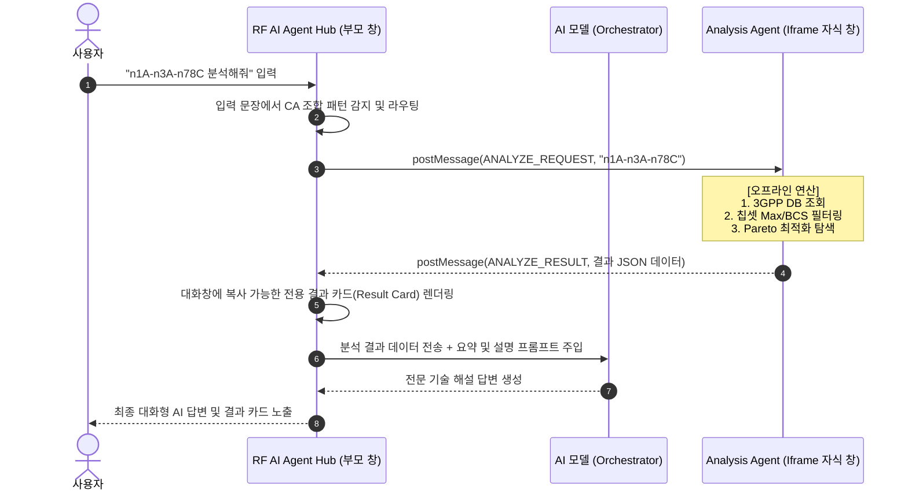

# RF AI Agent Hub

> **RF AI Orchestrator 및 하위 에이전트 통합 플랫폼**  
> Anthropic Claude / Gemini 연동 대화형 AI 챗 인터페이스 & 완전 오프라인 5G NR CA 대역폭 최적화 분석기


**RF AI Agent Hub**는 무선 통신(RF) 기술 검토 및 3GPP 규격 분석을 돕는 대화형 AI 오케스트레이터 플랫폼입니다.  
사용자의 자연어 질문 의도를 정교하게 라우팅하여, 연동된 전문 에이전트(Iframe)가 오프라인으로 5ms 이내에 물리 계층 분석을 완결하고 AI가 이를 해설하는 하이브리드 인텔리전스 방식을 구현했습니다.

---

## 🎨 주요 특징 및 디자인

*   **프리미엄 글래스모피즘 (Glassmorphism)**: 투명도가 적용된 다크 톤앤매너(`backdrop-filter: blur`, `#090d16` 테마)와 몽환적인 백그라운드 오르브(Glow Orbs)로 구성된 최신형 모던 UI/UX.
*   **하이브리드 AI 오케스트레이션**: 복잡한 3GPP 규격 연산은 로컬 웹브라우저 엔진(JavaScript)이 100% 신뢰성 있게 처리하고, AI 모델은 이 데이터를 해석하여 사용자에게 인간 친화적인 해설 답변을 생성합니다.
*   **멀티 에이전트 및 서브 페이지**: 5G NR CA 최대 대역폭 분석 에이전트와 이의 동작 방식을 기술한 단계별 워크플로우, SVG 인터랙티브 순서도를 하나로 묶은 패키지 구성.

---

## 🏗️ 시스템 아키텍처 및 동작 원리

메인 허브(`rf_ai_agent_hub_post_msg_working.html`)와 분석 에이전트(`SA_NR_CA_Max_BW_Analysis_Agent.html`)는 브라우저 보안 규격을 준수하는 비비동기 `postMessage` 채널을 통해 연동됩니다.



---

## 📂 파일 구성

```
antigravity_rf_hub/
├── rf_ai_agent_hub_post_msg_working.html   # 메인 RF AI Agent Hub (Claude/Gemini AI 채팅창)
├── SA_NR_CA_Max_BW_Analysis_Agent.html     # 하위 에이전트: 5G NR CA 대역폭 분석기 (Iframe 연동)
├── ca_bw_db.js                             # 3,250개 CA 조합 표준 데이터베이스
├── flowchart.html                          # 동작 순서도 (SVG 인터랙티브 툴팁 탑재)
├── workflow.html                           # 단계별 워크플로우 아코디언 및 기본 규칙표
├── scroll_fix_summary.md                   # 스크롤 버그 조치 완료 상세 내역
├── nrca_agent_interaction_architecture.md  # 에이전트 간 postMessage 통신 아키텍처 기술서
└── manual.pdf                              # 도구 사용 설명서 PDF
```

---

## ⚙️ 빠른 배포 및 시작 (GitHub Pages)

본 프로젝트는 데이터베이스가 프론트엔드 자바스크립트 변수로 완전 내장되어 있어, 별도의 백엔드 서버 없이 GitHub Pages에서 100% 활성화됩니다.

### 1. 저장소 구성 및 호스팅
GitHub Pages는 기본적으로 `index.html` 파일을 메인 진입점으로 감지합니다. 원활한 배포를 위해 다음과 같이 배치해 주세요.

*   **배포 방법 A**: `rf_ai_agent_hub_post_msg_working.html` 파일명을 **`index.html`**로 변경하여 저장소 루트에 커밋합니다.
*   **배포 방법 B**: 저장소 설정의 `GitHub Pages` 경로를 지정하고 아래 주소 뒤에 파일명을 명시적으로 넣어 접속합니다.
    ```
    https://{GitHub-ID}.github.io/{Repository-Name}/rf_ai_agent_hub_post_msg_working.html
    ```

### 2. API Key 준비
*   **Anthropic Claude** 또는 **Gemini**의 API 키를 발급받아, 첫 접속 시 표시되는 API Key 입력창에 붙여넣습니다.
*   API 키는 오직 해당 브라우저의 로컬 스토리지(`localStorage`) 혹은 메모리에만 암호화되어 안전하게 보존되며, 외부 백엔드 서버로 전송되지 않는 안심 보안 구조입니다.

---

## 🛡️ 기술적 이점 (Technical Advantages)

1.  **AI 환각 차단**: 통신 규격 대역폭 계산은 LLM이 계산할 시 고질적인 수식 환각오류가 발생합니다. 본 아키텍처는 검증된 자바스크립트 엔진이 100% 무오류로 선 계산하여 AI에게 전달하므로 신뢰성 높은 결과만을 대화형으로 제공합니다.
2.  **초고속 응답 속도**: 대규모의 Combinatorics(조합 최적화) 계산이 5ms 이내로 클라이언트 브라우저에서 끝납니다.
3.  **데이터 기밀성**: 민감한 통신망 주파수 구성 및 캐리어 디자인 값이 외부 클라우드로 유출되지 않고 프라이빗하게 분석됩니다.

---

## 📑 규격 기준

*   **3GPP TS 38.101-1 V19.5.0** (User Equipment radio transmission and reception; Part 1: Range 1 Standalone) 기반 데이터베이스 구축.
